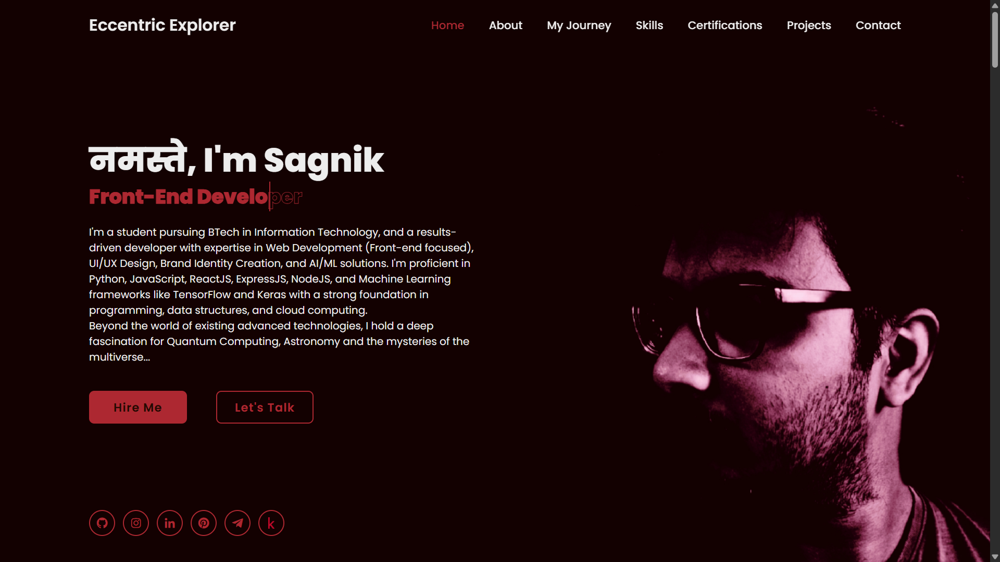

# <div align="center">MY PORTFOLIO</div>

A fully responsive animated personal portfolio website, responsive for all devices, built using HTML, CSS, and JavaScript.

## Live Demo

Experience it live here: [**Me**](https://eccentriccoder01.github.io/Me)

 <div align="center">
 <p>

[](https://github.com/ellerbrock/open-source-badges/)


 </p>
 </div>

## 📸 Screenshots

<div align="center"></div>

## 📺 Video Explanation

For a detailed walkthrough of my portfolio, check out this GIF:


## 🛠️ Technologies Used

### Frontend


## ⚙️ Installation and Setup

To run locally:

1. **Clone the repository:**
   ```bash
   git clone https://github.com/eccentriccoder01/Me.git
   cd Me
   ```

## Issue Creation ✴
Report bugs and  issues or propose improvements through our GitHub repository.

## Contribution Guidelines 📑

- Firstly Star(⭐) the Repository
- Fork the Repository and create a new branch for any updates/changes/issue you are working on.
- Start Coding and do changes.
- Commit your changes
- Create a Pull Request which will be reviewed and suggestions would be added to improve it.
- Add Screenshots and updated website links to help us understand what changes is all about.

- Check the [CONTRIBUTING.md](CONTRIBUTING.md) for detailed steps...

    
## Contributing is fun🧡

Enhance this project with your contributions! Whether you have innovative suggestions, spot bugs, or wish to introduce new features.
Contributions of any kind from anyone are always welcome🌟❕

Your insights are invaluable to us. Reach out to us team for any inquiries, feedback, or concerns.

## 📄 License

This project is open-source and available under the MIT License.

## 📞 Contact

Developed by [Eccentric Explorer](https://eccentriccoder01.github.io/Me)

Feel free to reach out with any questions or feedback\!


